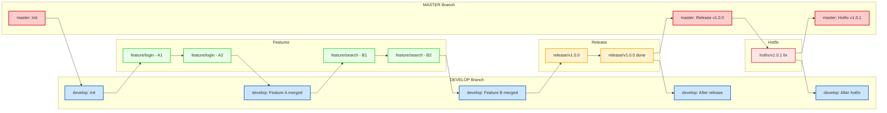

Here's a **color-coded Git Flow diagram** written in **[Mermaid](https://mermaid.js.org/)** syntax. You can paste this into a Markdown file that supports Mermaid rendering (like on GitHub, GitLab, Obsidian, or VS Code with plugins) to visualize it interactively.

---

### ✅ **Mermaid Git Flow Diagram with Color-Coding**

---

### 🧩 Color Key:

* 🔴 `master`: Production branch (stable, tagged)
* 🔵 `develop`: Integration branch (merges features and hotfixes)
* 🟢 `feature/*`: New features
* 🟡 `release/*`: Pre-production, testing before release
* 🔴 (light) `hotfix/*`: Emergency fixes

---

Let me know if you'd like a **horizontal timeline**, Git commands for each step, or a Mermaid Gantt chart version!
